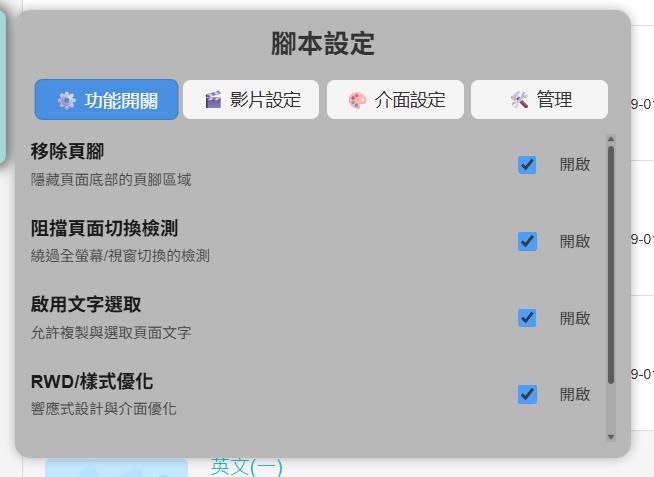

# TronClass 前端研究與功能優化腳本

> 使用 TypeScript + Vite 開發的前端用戶腳本，主要用於學術研究與前端行為分析。  
> ⚠ 本專案僅供學術研究與學習用途，**禁止用於任何未授權或非法行為**。



## 環境需求

- Node.js 20 以上
- npm 或 yarn
- 瀏覽器需安裝 [Tampermonkey](https://www.tampermonkey.net/)

## 注意事項

> ⚠️ 本腳本的部分功能可能 **違反 TronClass 平台使用者服務條款 (ToS)**，包括但不限於修改頁面行為、模擬操作流程或繞過平台限制。  
> 使用者須完全理解並自行承擔因此可能帶來的風險，包括帳號封鎖、課程資料變動或法律責任。

請確保在 **測試帳號、非正式課程環境** 下進行學術研究或前端分析，嚴禁任何可能影響正式教學或侵犯平台權益的行為。

- 請勿將本腳本用於實際課程操作
- 功能描述僅作 **前端學習、研究與測試用途**
- 若有建議或發現 bug，請透過 GitHub Issue 回報

## 安裝步驟

1. 下載或 clone 本專案：

```bash
git clone https://github.com/a3510377/ulearn-script.git
cd ulearn-script
```

2. 安裝依賴套件：

```bash
npm install
# 或
yarn install
```

3. 建置專案：

```bash
npm run build
# 或
yarn build
```

4. 將 `dist` 目錄下的腳本安裝到 **Tampermonkey**。

5. 開啟 **虎尾科技大學 ULearn 平台**，腳本將自動啟用。

## 功能概述

- 一些功能

> ⚠ 嚴禁將本腳本用於正式課程作弊、未授權下載或破壞學校平台安全。建議僅使用測試帳號進行研究。

## 免責聲明

1. **用途限制**
   本腳本僅用於 **學術研究、前端行為分析及學習用途**。禁止用於任何非法、商業或未經授權的行為，包括但不限於破解、作弊、侵入他人系統、繞過學校平台安全機制等。

2. **自負風險**
   使用本腳本可能會修改頁面元素、操作流程或系統行為，造成使用體驗與官方功能不一致。使用者應自行承擔使用過程中可能產生的任何後果，包括但不限於：帳號封鎖、資料遺失、系統異常、課程紀錄變更或功能失效。

3. **不保證可用性**
   本腳本僅在特定平台測試，其他學校 TronClass 平台可能不適用。本腳本對任何平台的功能穩定性或兼容性 **不作任何保證**。

4. **法律責任**
   使用者須遵守當地法律、學校規範及平台服務條款。若使用本腳本違反法律、學校規範或平台 ToS，所產生的任何法律責任或損失，均由使用者自行承擔。開發者不承擔任何法律責任。

5. **智慧財產權**
   本腳本不授權使用者侵犯 TronClass 或其他第三方的智慧財產權。使用者不得將腳本用於未經授權的操作或商業用途。開發者對使用者侵權行為 **不承擔責任**。

6. **安全風險**
   使用本腳本可能涉及個人資訊、帳號密碼或設備安全風險，包括但不限於：

   - 個人資料或帳號資訊洩露
   - 系統或瀏覽器錯誤導致資料損失
   - 潛在與第三方軟體互相影響的風險
     使用者應自行承擔上述風險，並妥善備份資料。

7. **開發者責任限制**
   對於因使用本腳本造成的任何直接、間接、偶然、特殊或衍生損害，開發者概不負責，無論是明示或默示，包括但不限於業務中斷、資料損失、系統損害或其他損失。

8. **研究環境限制**
   建議使用者僅在測試帳號及非正式課程環境中使用腳本，以避免干擾正式教學或課程資料。

9. **修改與更新**
   本腳本及免責聲明可能隨時更新，更新後將自動生效。使用者應定期查看並遵守最新版本內容。

10. **接受條款**
    安裝或使用本腳本即表示使用者已閱讀、理解並同意遵守本免責聲明的全部內容。
